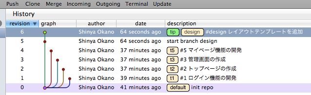

デザインをコミットする
======================

デザインテンプレート、メディアファイルの扱いは非常に難しいところです。

また、デザイナーの技量や作業人数により、勝手がずいぶん変わります。

基本的に、FTP、SCPなどをGUIクライアントから利用してサーバにファイルをアップロードして動作を確認した後、サーバ上でファイルをコミットします。

デザインはブランチで
--------------------

デザインテンプレート、メディアファイルについても、ソースコードと同様にブランチにコミットします。

これは、システムとマージする際にマージに失敗しても、正常動作時の状態に戻せるようにするためです。

ブランチもソースコードと同様にチケット番号に対応したものにコミットを行うことを推奨します。

システムの変更がなくてもデザインが頻繁に変わる場合には、これが煩わしく、大仰であるかもしれません。その場合には、一つのデザイン用ブランチを作成して、そこにコミットします。

::

  $ cd example-prj
  $ hg branch
  default
  $ hg branch design  # defaultからデザイン用のブランチを作る
  $ hg commit  # コミットする

hgwebcommit
-----------

コマンド操作に慣れているデザイナーであれば、サーバ上でテンプレートの動作を確認後、コマンドを使用してそのままコミットを行ってもらいます。しかし、コマンド操作を行えるデザイナーは少数派です。

そこで、Webベースのコミットツールである `hgwebcommit`_ を使用します。

.. _`hgwebcommit`: https://bitbucket.org/tokibito/flask-hgwebcommit

システム変更に伴うデザインのコミット
------------------------------------

システムのソースコードを追加、変更して、それに伴うデザインの追加、修正が必要な場合には、デザイナーの確認用環境のブランチをシステムのソースコード変更がコミットされたブランチに切り替えてコミットします。
