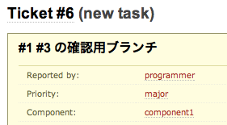
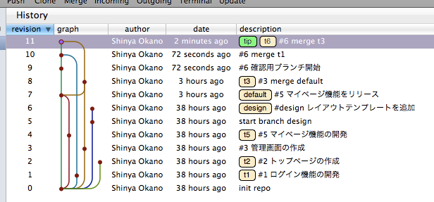

集約ブランチ
============

複数のブランチの変更内容を同じ環境で動作確認したり、変更をまとめるために、集約ブランチを作成して、それぞれのブランチをマージします。

チケットの作成
--------------

ブランチ番号を確保するために、チケットを作成します。

確認用ブランチの作成
--------------------

チケット番号に対応したブランチを作成します。

::

  $ hg update default
  $ hg branch t6
  $ hg commit  # ブランチをコミット

対象のブランチをマージします。

::

  $ hg update default
  $ hg merge t1
  $ hg commit
  $ hg merge t3
  $ hg commit

