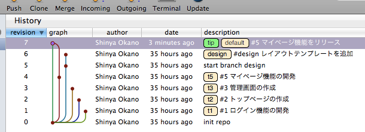
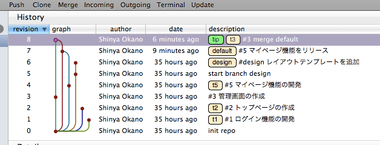

ブランチのマージ
================

リリースの際のマージ
--------------------

ブランチで開発した機能、デザインをプロダクション環境へデプロイ、リリースするために ``default`` ブランチへのマージを行います。

::

  $ hg update default
  $ hg branch
  default
  $ hg merge t5  # t5ブランチの変更をリリースするため、defaultブランチにマージする
  $ hg commit

最新の変更に追従するためのマージ
--------------------------------

リリースが行われると、未リリースのブランチにも変更を取り込まなければいけません。対象のブランチに ``default`` ブランチをマージします。

::

  $ hg update t3
  $ hg merge default  # t3ブランチに最新のコードを取り込むためdefaultブランチをマージする
  $ hg commit

.. note:: リリースの際には最新の変更を対象のブランチに取り込んでからマージします。こうすることで、リリースの際のマージでは resolve が発生しない状態にできます。

.. note:: この操作でrebase拡張を使用するかどうかについては検討の余地があります。
