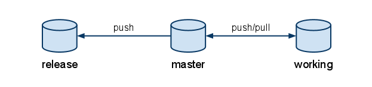

リポジトリの構成
================

分散バージョン管理システムを利用するので、リポジトリの構成、各リポジトリの役割について把握しておく必要があります。

マスターリポジトリ(master)
--------------------------

**すべての成果** が入っているリポジトリ。

:リポジトリパス例: /var/hg/example-prj

リリースリポジトリ(release)
---------------------------

**プロダクション環境にリリースされるソースコードのみ** が入っているリポジトリ。基本的に ``default`` ブランチのみがアクティブな状態。デプロイを行う際には、このリポジトリの ``default`` ブランチのソースコードが使用される。

:リポジトリパス例: /var/hg/example-prj-release

作業リポジトリ(working)
-----------------------

ソースコードの追加変更等の作業を行うリポジトリ。各作業者のホームディレクトリ以下にマスターから ``clone`` してくる。

:リポジトリパス例: /home/programmer/example-prj
